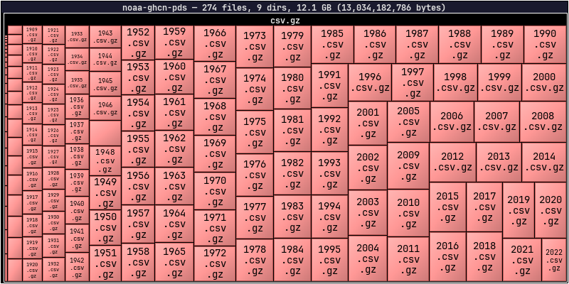
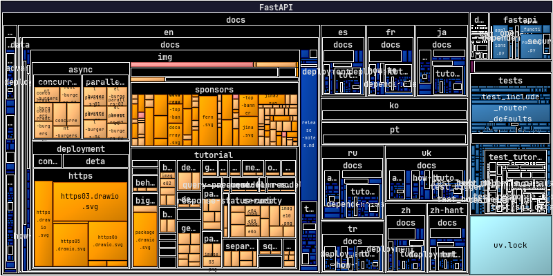
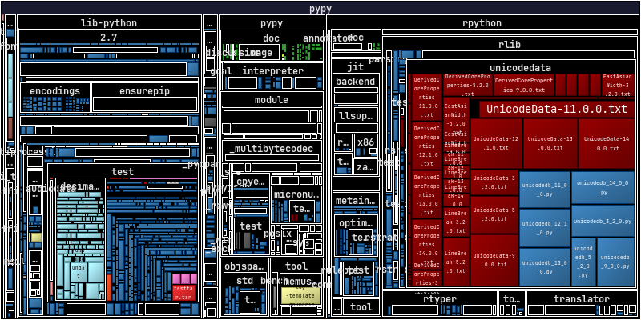
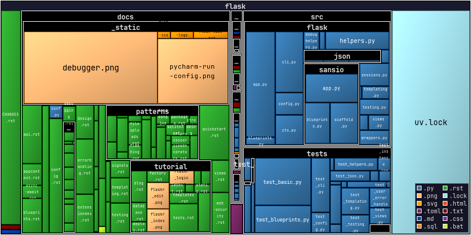
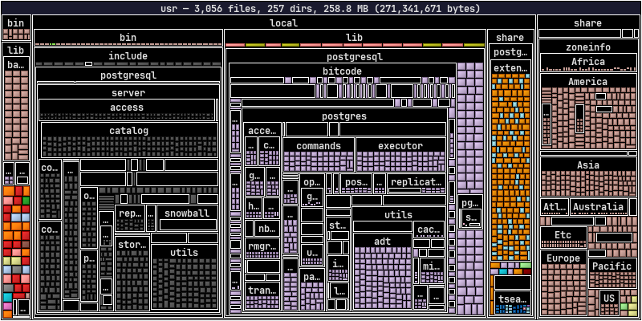
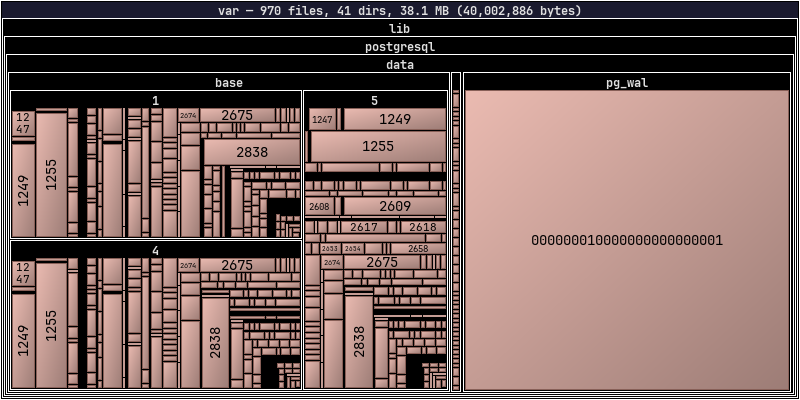

# Examples for Remote Access

*dirplot* can scan directory trees on remote sources (remote servers via SSH, AWS S3 buckets, Github repositories, Docker containers, and Kubernetes pods) without copying files locally. Remote backends are optional dependencies — install only what you need.

> **Warning:** Remote trees can contain hundreds of thousands of files. Use `--depth N` to limit how far down the tree dirplot recurses until you have a feel for the size of the target.

---

## Remote Servers via SSH

Scan hosts reachable over SSH using [paramiko](https://www.paramiko.org/).

```bash
pip install "dirplot[ssh]"
```

### Usage

```bash
# ssh://user@host/path format
dirplot map ssh://alice@prod.example.com/var/www

# SCP-style user@host:/path format
dirplot map alice@prod.example.com:/var/www

# Exclude paths, cap depth, save to file
dirplot map ssh://alice@prod.example.com/var --exclude /var/cache --depth 4 --output remote.png --no-show
```

### Authentication

Credentials are resolved in this order:

1. `--ssh-key PATH` — explicit private key file
2. `SSH_KEY` environment variable — path to key file
3. `IdentityFile` from `~/.ssh/config` for the target host
4. ssh-agent (picked up automatically)
5. `--ssh-password` / `SSH_PASSWORD` environment variable
6. Interactive password prompt as a last resort

### SSH config

`~/.ssh/config` is read automatically. Host aliases, custom ports, and `IdentityFile` directives all work as expected:

```
Host prod
    HostName prod.example.com
    User alice
    IdentityFile ~/.ssh/prod_key
    Port 2222
```

```bash
dirplot map ssh://prod/var/www   # resolves using the config block above
```

### Options

| Flag | Default | Description |
|---|---|---|
| `--ssh-key` | `~/.ssh/id_rsa` | Path to SSH private key |
| `--ssh-password` | `SSH_PASSWORD` env var | SSH password |
| `--depth` | unlimited | Maximum recursion depth |

### Python API

> **Note:** The programmatic Python API is still evolving and may change between releases without notice. Pin a specific version if you depend on it. The CLI interface is stable.

```python
from dirplot.ssh import connect, build_tree_ssh
from dirplot.render import create_treemap

client = connect("prod.example.com", "alice", ssh_key="~/.ssh/prod_key")
sftp = client.open_sftp()
try:
    root = build_tree_ssh(sftp, "/var/www", depth=5)
finally:
    sftp.close()
    client.close()

buf = create_treemap(root, width_px=1920, height_px=1080)
```

---

## AWS S3

Scan S3 buckets using [boto3](https://boto3.amazonaws.com/v1/documentation/api/latest/index.html). File sizes come from S3 object metadata — no data is downloaded.

```bash
pip install "dirplot[s3]"
```

### Usage

```bash
# Scan a bucket prefix
dirplot map s3://my-bucket/path/to/prefix

# Scan an entire bucket
dirplot map s3://my-bucket

# Public bucket (no AWS credentials needed)
dirplot map s3://noaa-ghcn-pds --no-sign

# Use a named AWS profile, cap depth, save to file
dirplot map s3://my-bucket/data --aws-profile prod --depth 3 --output s3.png --no-show
```

### Authentication

boto3's standard credential chain is used automatically — no extra configuration needed if your environment is already set up for AWS:

1. `--aws-profile` / `AWS_PROFILE` env var — named profile from `~/.aws/config`
2. `AWS_ACCESS_KEY_ID` / `AWS_SECRET_ACCESS_KEY` environment variables
3. `~/.aws/credentials` file
4. IAM instance role (on EC2 / ECS / Lambda)
5. `--no-sign` — skip signing entirely for anonymous access to public buckets

### Options

| Flag | Default | Description |
|---|---|---|
| `--aws-profile` | `AWS_PROFILE` env var | Named AWS profile |
| `--no-sign` | off | Anonymous access for public buckets |
| `--depth` | unlimited | Maximum recursion depth |
| `--exclude` | — | Full `s3://bucket/key` URI to skip (repeatable) |

### Python API

> **Note:** The programmatic Python API is still evolving and may change between releases without notice. Pin a specific version if you depend on it. The CLI interface is stable.

```python
from dirplot.s3 import make_s3_client, build_tree_s3
from dirplot.render import create_treemap

# Authenticated access
s3 = make_s3_client(profile="prod")

# Anonymous access to a public bucket
s3 = make_s3_client(no_sign=True)

root = build_tree_s3(s3, "my-bucket", "path/to/prefix/", depth=5)
buf = create_treemap(root, width_px=1920, height_px=1080)
```

### Public buckets to explore

These buckets are publicly accessible with `--no-sign`:

| Bucket | Contents |
|---|---|
| `s3://noaa-ghcn-pds` | NOAA Global Historical Climatology Network |
| `s3://noaa-goes16` | NOAA GOES-16 weather satellite imagery |
| `s3://sentinel-s2-l1c` | Copernicus Sentinel-2 satellite data (eu-central-1) |
| `s3://1000genomes` | 1000 Genomes Project |

<figure>
  
  <figcaption><code>dirplot map s3://noaa-ghcn-pds --no-sign --depth 2</code></figcaption>
</figure>

---

## GitHub Repositories

Scan any GitHub repository using the [Git trees API](https://docs.github.com/en/rest/git/trees). File sizes come from blob metadata — no file content is downloaded. No extra dependency is required; dirplot uses `urllib` from the Python standard library.

### Usage

```bash
# github:// scheme
dirplot map github://owner/repo

# Specific branch, tag, or commit SHA
dirplot map github://owner/repo@dev

# Full GitHub URL (also accepted)
dirplot map https://github.com/owner/repo/tree/main

# Save to file
dirplot map github://FastAPI/FastAPI --output fastapi.png --no-show
```

<figure>
  
  <figcaption><code>dirplot map github://FastAPI/FastAPI</code></figcaption>
</figure>

<!-- dirplot map github://torvalds/linux --inline -->

<figure>
  
  <figcaption><code>dirplot map github://python/cpython</code></figcaption>
</figure>

<figure>
  
  <figcaption><code>dirplot map github://pypy/pypy</code></figcaption>
</figure>

### Authentication

A token is **not required for public repositories** under normal use. Each scan makes 1–2 API calls, and GitHub allows 60 unauthenticated requests per hour per IP. A token is needed when:

- Scanning **private repositories**
- Running in CI/CD where many processes share the same IP
- Scanning repeatedly and hitting the unauthenticated rate limit

Tokens are resolved in this order:

1. `--github-token` flag
2. `GITHUB_TOKEN` environment variable
3. No token — anonymous access (public repos only, 60 req/h)

### Options

| Flag | Default | Description |
|---|---|---|
| `--github-token` | `GITHUB_TOKEN` env var | Personal access token |
| `--depth` | unlimited | Maximum recursion depth |
| `--exclude` | — | Repo-relative path to skip (repeatable) |

### Notes

- Dotfiles and dot-directories (`.github`, `.env`, etc.) are skipped, consistent with local scanning behaviour.
- If the repository tree exceeds GitHub's API limit (~100k entries), the response will be truncated. dirplot prints a warning and renders what was returned. Use `--depth` to avoid this.
- The `--depth` flag here applies to the in-memory tree built from the API response, not to the number of API calls (the full flat tree is always fetched in one request).

### Python API

> **Note:** The programmatic Python API is still evolving and may change between releases without notice. Pin a specific version if you depend on it. The CLI interface is stable.

```python
from dirplot.github import build_tree_github
from dirplot.render import create_treemap
import os

root, branch = build_tree_github(
    "pallets", "flask",
    token=os.environ.get("GITHUB_TOKEN"),
    depth=4,
)
print(f"Branch: {branch}, size: {root.size:,} bytes")
buf = create_treemap(root, width_px=1920, height_px=1080)
```

<figure>
  
  <figcaption><code>dirplot map github://pallets/flask --legend</code></figcaption>
</figure>

---

## Docker Containers

Scan a running Docker container's filesystem using `docker exec`. No extra dependency is required beyond the `docker` CLI being in `PATH`.

### Usage

```bash
# docker://container/path — slash separator
dirplot map docker://my-container/app

# docker://container:/path — colon separator (both forms accepted)
dirplot map docker://my-container:/app

# Cap depth, save to file
dirplot map docker://my-container:/usr --depth 3 --output container.png --no-show

# Real example
docker run -d --name pg-demo -e POSTGRES_PASSWORD=x postgres:17-alpine
dirplot map docker://pg-demo:/usr --inline
docker rm -f pg-demo
```

<figure>
  
  <figcaption><code>dirplot map docker://pg-demo:/usr --log</code></figcaption>
</figure>

### Requirements

- `docker` CLI in `PATH`
- The container must be running (`docker ps` should list it)
- The container image must have a `find` binary (true for all common Linux base images)

### Notes

- Symlinks are skipped.
- Dotfiles and dot-directories are skipped, consistent with local scanning behaviour.
- `find` is first attempted with GNU find's `-printf` for efficiency; if that fails (BusyBox/Alpine images), a POSIX `sh` + `stat` fallback is used automatically.

### Options

| Flag | Default | Description |
|---|---|---|
| `--depth` | unlimited | Maximum recursion depth |
| `--exclude` | — | Absolute path inside the container to skip (repeatable) |

### Python API

> **Note:** The programmatic Python API is still evolving and may change between releases without notice. Pin a specific version if you depend on it. The CLI interface is stable.

```python
from dirplot.docker import build_tree_docker
from dirplot.render import create_treemap

root = build_tree_docker("my-container", "/app", depth=5)
buf = create_treemap(root, width_px=1920, height_px=1080)
```

---

## Kubernetes Pods

Scan a running Kubernetes pod's filesystem using `kubectl exec`. No extra dependency is required beyond `kubectl` being in `PATH` and configured to reach a cluster.

### Usage

```bash
# Default namespace, slash separator
dirplot map pod://my-pod/app

# Default namespace, colon separator
dirplot map pod://my-pod:/app

# Explicit namespace via URL
dirplot map pod://my-pod@staging:/app

# Explicit namespace via flag (overrides @namespace in URL)
dirplot map pod://my-pod:/app --k8s-namespace staging

# Multi-container pod — pick a specific container
dirplot map pod://my-pod:/app --k8s-container sidecar

# Cap depth, save to file
dirplot map pod://my-pod:/usr --depth 3 --output pod.png --no-show

# Real example (minikube)
minikube start

kubectl run pg-demo --image=postgres:17-alpine --restart=Never \
  --env POSTGRES_PASSWORD=x
kubectl wait --for=condition=Ready pod/pg-demo --timeout=90s

dirplot map pod://pg-demo/var/lib/postgresql --inline

kubectl delete pod pg-demo --grace-period=0
```

<figure>
  
  <figcaption><code>dirplot map pod://pg-demo/var/</code></figcaption>
</figure>

### Requirements

- `kubectl` CLI in `PATH`, configured for a reachable cluster
- The pod must be in `Running` state
- The pod image must have a `find` binary (true for all common Linux base images)

### Notes

- Symlinks are skipped.
- Dotfiles and dot-directories are skipped, consistent with local scanning behaviour.
- Unlike Docker scanning, `-xdev` is intentionally omitted so that mounted volumes (emptyDir, PVC, etc.) within the scanned path are traversed — this is the common case in k8s where images declare `VOLUME` entries that k8s always mounts separately.
- `find` is first attempted with GNU find's `-printf`; if that fails (BusyBox/Alpine images), a POSIX `sh` + `stat` fallback is used automatically.

### Options

| Flag | Default | Description |
|---|---|---|
| `--k8s-namespace` | current context default | Kubernetes namespace |
| `--k8s-container` | pod default | Container name for multi-container pods |
| `--depth` | unlimited | Maximum recursion depth |
| `--exclude` | — | Absolute path inside the pod to skip (repeatable) |

### Python API

> **Note:** The programmatic Python API is still evolving and may change between releases without notice. Pin a specific version if you depend on it. The CLI interface is stable.

```python
from dirplot.k8s import build_tree_pod
from dirplot.render import create_treemap

root = build_tree_pod(
    "my-pod",
    "/app",
    namespace="staging",
    container="main",
    depth=5,
)
buf = create_treemap(root, width_px=1920, height_px=1080)
```
