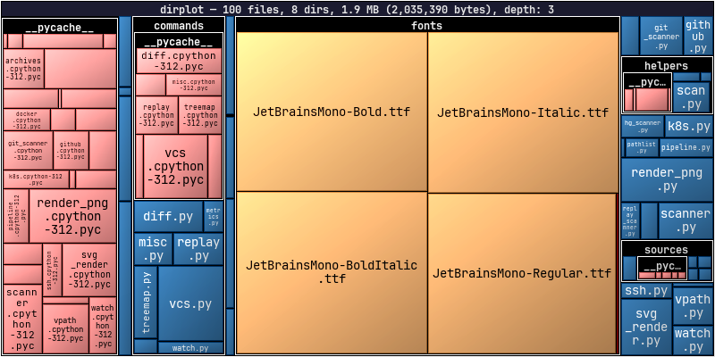
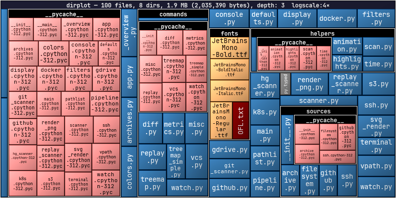
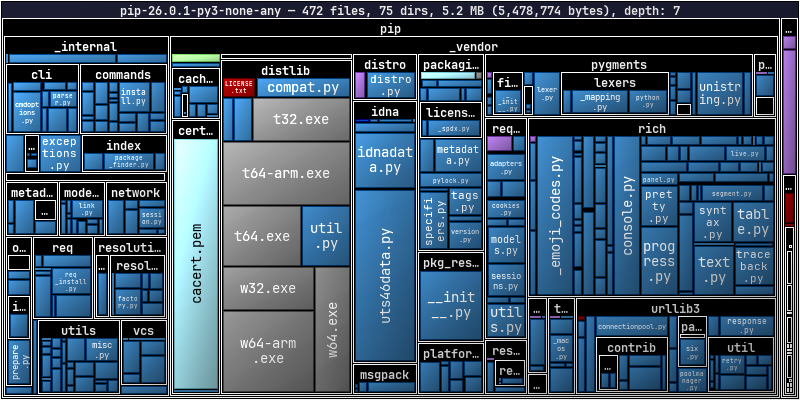
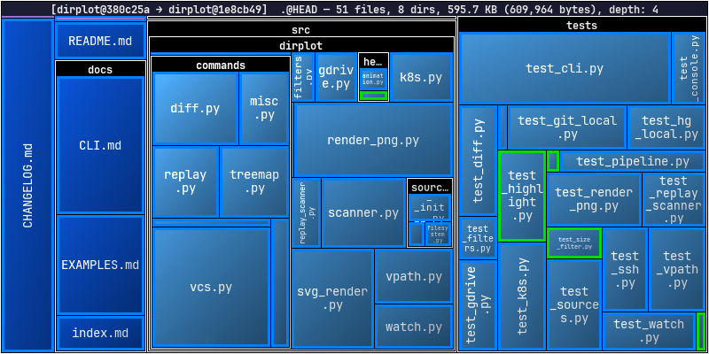
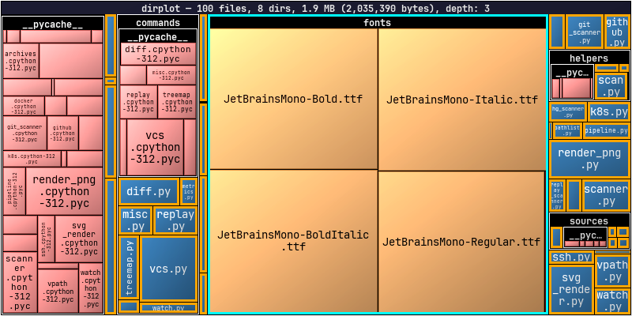

# Examples

← [Home](index.md)

- [Treemap](#treemap)
- [Log scale](#log-scale)
- [Archives](#archives)
- [Diff](#diff)
- [Highlighting](#highlighting)
- [Metrics](#metrics)
- [Remote Sources](#remote-sources)
- [Git & Mercurial History](#git--mercurial-history)

---

## Treemap

`--output treemap.svg` produces an interactive SVG — hover over any tile to see the full path and size in a floating tooltip, and CSS highlights show the hovered tile.

<figure>
  <object data="../images/treemap.svg" type="image/svg+xml" width="100%" style="display:block;aspect-ratio:2/1;"></object>
  <figcaption><code>dirplot map src/dirplot --log-scale 4 --output treemap.svg</code></figcaption>
</figure>

```bash
dirplot map .                              # current directory, opens in viewer
dirplot map . --inline                     # display in terminal (iTerm2/Kitty/Ghostty)
dirplot map . --output treemap.svg         # interactive SVG with hover tooltips
```

---

## Log scale

By default tile area is proportional to file size. When one file or directory dominates, everything else shrinks to tiny slivers. `--log-scale` compresses the size range so smaller files remain visible.

<figure>
  
  <figcaption><code>dirplot map src/dirplot</code></figcaption>
</figure>

<figure>
  
  <figcaption><code>dirplot map src/dirplot --log-scale 4</code></figcaption>
</figure>

```bash
dirplot map . --log-scale 4
```

---

## Archives

dirplot reads archive files directly as treemap inputs — no unpacking needed. Sizes come from the uncompressed sizes stored in the archive metadata. See [Archive Formats](archives.md) for the full list of supported formats.

<figure>
  
  <figcaption><code>dirplot map pip-26.0.1-py3-none-any.whl</code></figcaption>
</figure>

```bash
dirplot map project.zip
dirplot map release.tar.gz
dirplot map app.jar
dirplot map library.whl
```

---

## Diff

Colour-coded borders show what changed between two trees: **green** = added, **red** = removed, **blue** = modified. Works with any two sources — directories, commits, archives, GitHub tags, S3 prefixes, containers.

<figure>
  
  <figcaption><code>dirplot diff .@HEAD~50 .@HEAD --changed-only</code></figcaption>
</figure>

```bash
dirplot diff .                             # uncommitted changes in current repo
dirplot diff .@HEAD~5 .@HEAD              # last 5 commits
dirplot diff old/ new/                     # two local directories
dirplot diff github://owner/repo@v1.0 github://owner/repo@v2.0
dirplot diff release-1.0.tar.gz release-2.0.tar.gz
```

---

## Highlighting

The `--highlight`/`-H` flag draws coloured borders around matching files or directories. Patterns support `*` and `**` globs; append `@color` to pick a colour (defaults to red). Works on `map`, `diff`, `git`, `hg`, and `replay`.

```bash
dirplot map . --highlight "src/main.py"                    # single file, red
dirplot map . --highlight "**/*.py@orange"                 # all Python files
dirplot map . --highlight "src@orange" --highlight "**/*.md@cyan"
```

<figure>
  
  <figcaption><code>dirplot map src/dirplot --highlight "**/*.py@orange" --highlight "src/dirplot/fonts@cyan"</code></figcaption>
</figure>

Colours accept any CSS name (`red`, `orange`, `lime`, `cyan`, `#ff8800`, …). Both PNG and SVG output are supported.

---

## Metrics

`dirplot metrics` prints file/dir counts, total size, depth, top extensions by count or size, and the largest files and directories with their share of total size.

```bash
dirplot metrics .
dirplot metrics . --sort-by size           # sort extensions by bytes
dirplot metrics . --top 5 --json           # JSON output, top 5 per list
dirplot map . --metrics --no-show          # treemap + metrics in one pass
```

---

## Remote Sources

dirplot scans remote trees without downloading files. See [Remote Sources](remote-sources.md) for authentication, options, and full reference per backend.

```bash
dirplot map github://pallets/flask
dirplot map s3://noaa-ghcn-pds --no-sign --depth 2
dirplot map ssh://alice@prod.example.com/var/www
dirplot map gdrive://                      # Google Drive (requires gog)
dirplot map docker://my-container:/app
dirplot map pod://my-pod:/app
```

---

## Git & Mercurial History

Animate a repository's commit history as a treemap — one frame per commit, with colour-coded borders showing what changed. Mercurial is equally supported via `dirplot hg`. See [`dirplot git`](cli.md#dirplot-git--git-history-treemap) and [`dirplot hg`](cli.md#dirplot-hg--mercurial-history-treemap) for the full options reference.

```bash
dirplot git . --output snapshot.png                        # snapshot of HEAD
dirplot git . --range main --output history.mp4            # full history as MP4
dirplot git . --period 30d --total-duration 20 --output history.mp4
dirplot git github://owner/repo --range v1.0..v2.0 --output release.mp4

dirplot hg . --range 0:tip --output history.png            # full Mercurial history
```

<figure>
  <video src="../images/steipete-birdclaw.mp4#t=12" controls loop muted playsinline width="100%"></video>
  <figcaption><code>dirplot git https://github.com/steipete/birdclaw --canvas 1000x600 --range main -o steipete-birdclaw.mp4</code></figcaption>
</figure>

To animate real-time filesystem activity, record with `dirplot watch` and replay with `dirplot replay`:

```bash
dirplot watch . --output events.jsonl
dirplot replay events.jsonl --output timelapse.mp4 --total-duration 30
```
