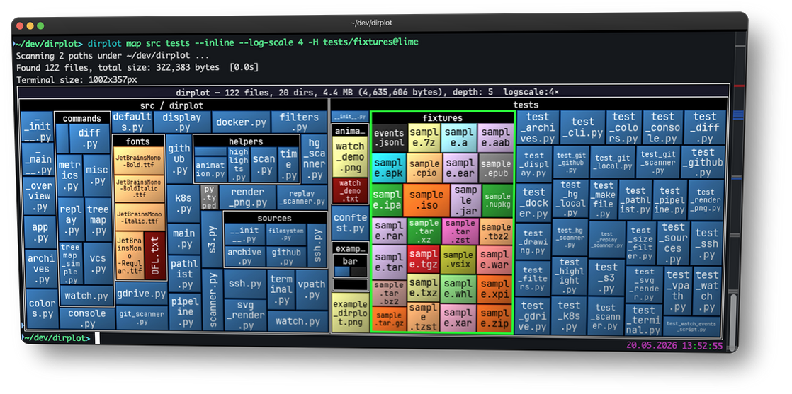

# dirplot

**dirplot** creates nested treemap images for directory trees. It can display them in the system image viewer or inline in the terminal (iTerm2 and Kitty protocols, auto-detected). It also animates git history, watches live filesystems, and scans remote sources.

```bash
pip install dirplot
dirplot map .          # treemap of current directory, opens in system viewer
dirplot map . --inline # display inline in terminal (iTerm2 / Kitty / Ghostty)
```



## Use cases

- **Find what's eating your disk** — map `~/Downloads`, `~/.cache`, or `node_modules` across a monorepo to spot the culprits at a glance.
- **Inspect before you install** — visualise a Python wheel, JAR, or RPM without unpacking it.
- **Understand a codebase instantly** — map a legacy project or a large GitHub repo to grasp its structure before reading a single line.
- **Compare releases** — diff two archive versions or two git tags to see exactly what grew, shrank, or disappeared.
- **Scan remote filesystems** — map an SSH host, S3 bucket, Docker container, or Kubernetes pod without copying anything locally.
- **AI & data exploration** — map a vector database, model weights directory, or agent memory folder (`~/.claude/projects/`).
- **Sysadmin at a glance** — map `/var/log` to see which services generate the most logs, or scan a container image's filesystem layers.
- **Animate history** — watch a repository or live filesystem evolve over time as a timelapse.

## Features

- Squarified treemap layout; file area proportional to size; per-extension colours (GitHub Linguist palette for known types, configurable Matplotlib colormap for the rest).
- PNG, animated PNG (APNG), MP4, and MOV output for single frames and animations; interactive SVG for static maps; renders at terminal pixel size or a custom `WIDTHxHEIGHT`.
- **[Inline terminal display](guides.md#inline-terminal-display)** — renders directly into iTerm2, Kitty, Ghostty, WezTerm, and Warp without opening a separate window; protocol auto-detected.
- **Animate git history** ([`dirplot git`](cli.md#dirplot-git--git-history-treemap)), **Mercurial history** ([`dirplot hg`](cli.md#dirplot-hg--mercurial-history-treemap)), and **replay filesystem event logs** ([`dirplot replay`](cli.md#dirplot-replay--event-log-replay)) — output APNG, MP4, or MOV. **Watch live filesystems** ([`dirplot watch`](cli.md#dirplot-watch--live-watch-mode)) to record a JSONL event log for replay, with an optional live snapshot.
- **Scan metrics** ([`dirplot metrics`](cli.md#dirplot-metrics--directory-metrics)) — file/dir counts, total size, depth, top extensions by count or size, largest files and directories with percentage of total; JSON output supported.
- **Compare two trees** ([`dirplot diff`](cli.md#dirplot-diff--compare-two-directory-trees)) — treemap diff of any two sources (local dirs, GitHub repos, archives, S3, SSH, Docker, K8s, or two commits/tags); `dirplot diff .` shows uncommitted changes; files sized by B; colour-coded borders show added (green), removed (red), and changed (blue) files. Git/hg repos scan only tracked files; change detection uses blob hashes (LFS-aware).
- Scan **SSH hosts**, **AWS S3**, **GitHub repos** (public and private), **Docker containers**, **Kubernetes pods**, and **Google Drive** — no extra deps beyond the respective CLI. See [Examples](examples.md).
- Read **[archives](archives.md)** directly (zip, tar, 7z, rar, jar, whl, …) without unpacking.
- Works on macOS, Linux, and Windows ([WSL2 fully supported](troubleshooting.md#windows--wsl2-notes)).

## Quick start

```bash
dirplot map .                                # current directory, opens in viewer
dirplot map . --inline                       # display in terminal (iTerm2/Kitty/Ghostty)
dirplot map . --output treemap.png --no-show # save to file
dirplot map . --log-scale 4                  # log scale when one file dominates
dirplot map github://pallets/flask           # GitHub repo
dirplot map project.zip                      # archive — no unpacking needed

dirplot diff .                               # uncommitted changes
dirplot diff .@HEAD~5 .@HEAD                 # last 5 commits

dirplot metrics .                            # file counts, sizes, top extensions
dirplot git . --range main --output h.mp4    # full git history as MP4
```

See [Examples](examples.md) for the full command gallery.

## Contributing

Bug reports, feature requests, and example contributions are welcome — please [open an issue](https://github.com/deeplook/dirplot/issues) on GitHub.

See the full [changelog and releases](https://github.com/deeplook/dirplot/releases) for what's new in each version.
