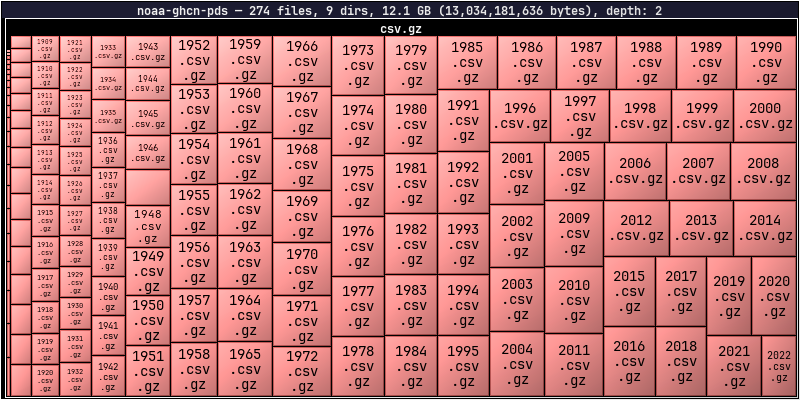
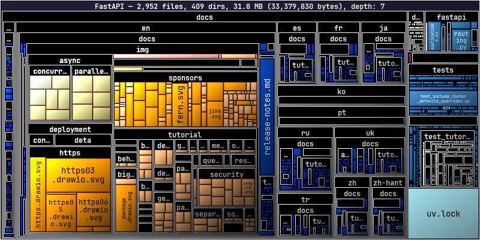
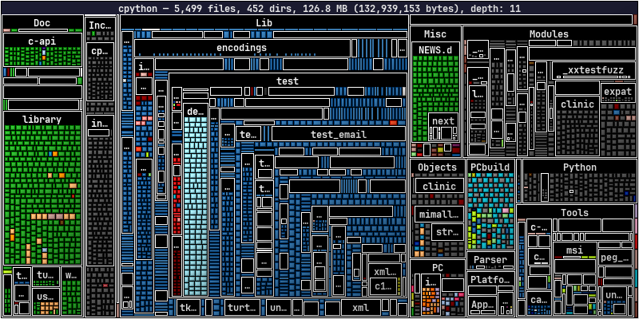
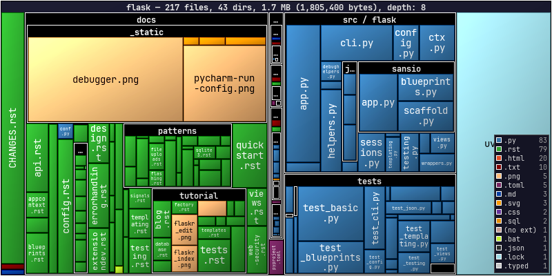
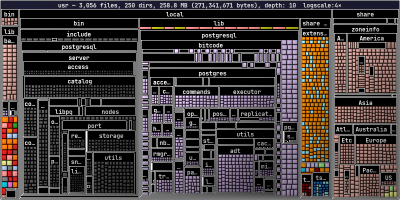
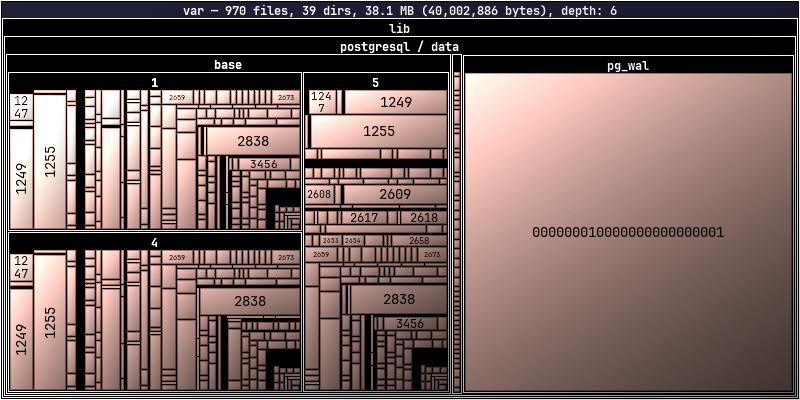

# Remote Sources

← [Home](index.md)

dirplot can scan directory trees on remote sources without copying files locally. Remote backends are optional dependencies — see [Installation](installation.md) for what to install per backend.

> **Warning:** Remote trees can contain hundreds of thousands of files. Use `--depth N` to limit how far down the tree dirplot recurses until you have a feel for the size of the target. Start with `--depth 3`.

> **Tip:** If one large file dominates the layout and squashes everything else into tiny slivers, add `--log-scale 4` to compress the size range. Values in the range **2–10** are most useful.

- [SSH](#remote-servers-via-ssh)
- [AWS S3](#aws-s3)
- [GitHub Repositories](#github-repositories)
- [Google Drive](#google-drive)
- [Docker Containers](#docker-containers)
- [Kubernetes Pods](#kubernetes-pods)

---

## Remote Servers via SSH

Scan hosts reachable over SSH using [paramiko](https://www.paramiko.org/).

```bash
pip install "dirplot[ssh]"
```

### Usage

```bash
# ssh://user@host/path format
dirplot map ssh://alice@prod.example.com/var/www

# SCP-style user@host:/path format
dirplot map alice@prod.example.com:/var/www

# Exclude paths, cap depth, save to file
dirplot map ssh://alice@prod.example.com/var --exclude /var/cache --depth 4 --output remote.png --no-show
```

### Authentication

Credentials are resolved in this order:

1. `--ssh-key PATH` — explicit private key file
2. `IdentityFile` from `~/.ssh/config` for the target host
3. ssh-agent (picked up automatically)
4. `--ssh-password-file FILE` — file containing the SSH password
5. Interactive password prompt as a last resort

### SSH config

`~/.ssh/config` is read automatically. Host aliases, custom ports, and `IdentityFile` directives all work as expected:

```
Host prod
    HostName prod.example.com
    User alice
    IdentityFile ~/.ssh/prod_key
    Port 2222
```

```bash
dirplot map ssh://prod/var/www   # resolves using the config block above
```

### Options

| Flag | Default | Description |
|---|---|---|
| `--ssh-key` | standard SSH key paths | Path to SSH private key |
| `--ssh-password-file` | — | File containing SSH password |
| `--depth` | unlimited | Maximum recursion depth |

---

## AWS S3

Scan S3 buckets using [boto3](https://boto3.amazonaws.com/v1/documentation/api/latest/index.html). File sizes come from S3 object metadata — no data is downloaded.

```bash
pip install "dirplot[s3]"
```

### Usage

```bash
# Scan a bucket prefix
dirplot map s3://my-bucket/path/to/prefix

# Scan an entire bucket
dirplot map s3://my-bucket

# Public bucket (no AWS credentials needed)
dirplot map s3://noaa-ghcn-pds --no-sign

# Use a named AWS profile, cap depth, save to file
dirplot map s3://my-bucket/data --aws-profile prod --depth 3 --output s3.png --no-show
```

### Authentication

boto3's standard credential chain is used automatically — no extra configuration needed if your environment is already set up for AWS. Credentials are resolved in this order:

1. `--aws-profile` (or `AWS_PROFILE` env var) — named profile from `~/.aws/config`
2. `AWS_ACCESS_KEY_ID` / `AWS_SECRET_ACCESS_KEY` environment variables
3. `~/.aws/credentials` file
4. IAM instance role (on EC2 / ECS / Lambda)
5. `--no-sign` — skip signing entirely for anonymous access to public buckets

`--aws-profile` takes precedence over `AWS_PROFILE` and all lower-priority methods in the chain.

### Options

| Flag | Default | Description |
|---|---|---|
| `--aws-profile` | `AWS_PROFILE` env var | Named AWS profile |
| `--no-sign` | off | Anonymous access for public buckets |
| `--depth` | unlimited | Maximum recursion depth |
| `--exclude` | — | Full `s3://bucket/key` URI to skip (repeatable) |

### Public buckets to explore

These buckets are publicly accessible with `--no-sign`. Use `--depth 2` or `--depth 3` on large buckets to avoid long scan times.

| Bucket | Contents | Quick start |
|---|---|---|
| `s3://noaa-ghcn-pds` | NOAA Global Historical Climatology Network | `dirplot map s3://noaa-ghcn-pds --no-sign --depth 2` |
| `s3://noaa-goes16` | NOAA GOES-16 weather satellite imagery | `dirplot map s3://noaa-goes16 --no-sign --depth 3` |
| `s3://sentinel-s2-l1c` | Copernicus Sentinel-2 satellite data (eu-central-1) | `dirplot map s3://sentinel-s2-l1c --no-sign --depth 2` |
| `s3://1000genomes` | 1000 Genomes Project | `dirplot map s3://1000genomes --no-sign --depth 3` |

<figure>
  
  <figcaption><code>dirplot map s3://noaa-ghcn-pds --no-sign --depth 2</code></figcaption>
</figure>

---

## GitHub Repositories

Scan any GitHub repository using the [Git trees API](https://docs.github.com/en/rest/git/trees). File sizes come from blob metadata — no file content is downloaded. No extra dependency is required; dirplot uses `urllib` from the Python standard library.

### Usage

```bash
# github:// scheme
dirplot map github://owner/repo

# Specific branch, tag, or commit SHA
dirplot map github://owner/repo@dev

# Full GitHub URL (also accepted)
dirplot map https://github.com/owner/repo/tree/main
```

### Authentication

A token is **not required for public repositories** under normal use. Each scan makes 1–2 API calls, and GitHub allows 60 unauthenticated requests per hour per IP. A token is needed when:

- Scanning **private repositories**
- Running in CI/CD where many processes share the same IP
- Scanning repeatedly and hitting the unauthenticated rate limit

**Option 1 — gh CLI (easiest):** authenticate once and dirplot picks up your credentials automatically:

```bash
gh auth login
dirplot map github://my-org/private-repo
```

**Option 2 — environment variable:**

```bash
export GITHUB_TOKEN=ghp_…
dirplot map github://my-org/private-repo
```

**Option 3 — token file:**

```bash
dirplot map github://my-org/private-repo --github-token-file ~/.github-token
```

Token resolution order: `--github-token-file` → `$GITHUB_TOKEN` → `gh auth token`.

### Options

| Flag | Default | Description |
|---|---|---|
| `--github-token-file` | `$GITHUB_TOKEN` | File containing personal access token |
| `--depth` | unlimited | Maximum recursion depth |
| `--exclude` | — | Repo-relative path to skip (repeatable) |

### Notes

- Dotfiles and dot-directories (`.github`, `.env`, etc.) are skipped, consistent with local scanning behaviour.
- If the repository tree exceeds GitHub's API limit (~100k entries), the response will be truncated. dirplot prints a warning and renders what was returned. Use `--depth` to avoid this.
- The `--depth` flag here applies to the in-memory tree built from the API response, not to the number of API calls (the full flat tree is always fetched in one request).

<figure>
  
  <figcaption><code>dirplot map github://tiangolo/fastapi</code></figcaption>
</figure>

<figure>
  
  <figcaption><code>dirplot map github://python/cpython</code></figcaption>
</figure>

<figure>
  
  <figcaption><code>dirplot map github://pallets/flask --legend</code></figcaption>
</figure>

---

## Google Drive

Scan a Google Drive using the [gog CLI](https://gogcli.sh/) — a unified Google Workspace CLI that handles OAuth2 authentication. No extra Python dependency is needed; dirplot shells out to `gog` the same way the Docker backend uses `docker exec`.

### Setup

```bash
# Install gog
brew install gogcli   # macOS

# Authenticate once (opens browser for OAuth2)
gog auth
```

### Usage

```bash
# Scan your entire Drive (My Drive + shared drives)
dirplot map gdrive://

# Scan with depth limit (recommended for large drives)
dirplot map gdrive:// --depth 3

# Scan a specific folder by its Drive folder ID
dirplot map gdrive://1BxiMVs0XRA5nFMdKvBdBZjgmUUqptlbs74OgVE2upms

# Display inline in terminal
dirplot map gdrive:// --depth 3 --log-scale 4 --inline
```

To find a folder ID: open the folder in Google Drive in your browser — the ID is the long string at the end of the URL (`https://drive.google.com/drive/folders/<FOLDER_ID>`).

### Notes

- **Google-native formats** (Docs, Sheets, Slides, Forms, …) have no byte size in the Drive API. dirplot shows them as 1 byte so they remain visible as tiles rather than disappearing.
- **Authentication** is handled entirely by `gog`. Run `gog auth` once; tokens are cached and refreshed automatically.
- **Large drives** can contain tens of thousands of files. Use `--depth N` to limit the scan until you have a feel for the size.
- **Dotfiles** and dot-directories are skipped, consistent with local scanning behaviour.

### Options

| Flag | Default | Description |
|---|---|---|
| `--depth` | unlimited | Maximum recursion depth |
| `--exclude` | — | Path pattern to skip (repeatable) |
| `--log-scale` | 0 (off) | Useful when a few large files dominate the layout |

---

## Docker Containers

Scan a running Docker container's filesystem using `docker exec`. No extra dependency is required beyond the `docker` CLI being in `PATH`.

### Usage

```bash
# docker://container/path — slash separator
dirplot map docker://my-container/app

# docker://container:/path — colon separator (both forms accepted)
dirplot map docker://my-container:/app

# Real example
docker run -d --name pg-demo -e POSTGRES_PASSWORD=x postgres:17-alpine
dirplot map docker://pg-demo:/usr --inline
docker rm -f pg-demo
```

### Requirements

- `docker` CLI in `PATH`
- The container must be running (`docker ps` should list it)
- The container image must have a `find` binary (true for all common Linux base images)

### Notes

- Symlinks are skipped.
- Dotfiles and dot-directories are skipped, consistent with local scanning behaviour.
- `find` is first attempted with GNU find's `-printf` for efficiency; if that fails (BusyBox/Alpine images), a POSIX `sh` + `stat` fallback is used automatically.

### Options

| Flag | Default | Description |
|---|---|---|
| `--depth` | unlimited | Maximum recursion depth |
| `--exclude` | — | Absolute path inside the container to skip (repeatable) |

<figure>
  
  <figcaption><code>dirplot map docker://pg-demo:/usr --log-scale 4</code></figcaption>
</figure>

---

## Kubernetes Pods

Scan a running Kubernetes pod's filesystem using `kubectl exec`. No extra dependency is required beyond `kubectl` being in `PATH` and configured to reach a cluster.

### Usage

```bash
# Default namespace
dirplot map pod://my-pod:/app

# Explicit namespace via URL or flag
dirplot map pod://my-pod@staging:/app
dirplot map pod://my-pod:/app --k8s-namespace staging

# Multi-container pod — pick a specific container
dirplot map pod://my-pod:/app --k8s-container sidecar

# Real example (minikube)
minikube start
kubectl run pg-demo --image=postgres:17-alpine --restart=Never --env POSTGRES_PASSWORD=x
kubectl wait --for=condition=Ready pod/pg-demo --timeout=90s
dirplot map pod://pg-demo/var/lib/postgresql --inline
kubectl delete pod pg-demo --grace-period=0
```

### Requirements

- `kubectl` CLI in `PATH`, configured for a reachable cluster
- The pod must be in `Running` state
- The pod image must have a `find` binary (true for all common Linux base images)

### Notes

- Symlinks are skipped.
- Dotfiles and dot-directories are skipped, consistent with local scanning behaviour.
- Unlike Docker scanning, `-xdev` is intentionally omitted so that mounted volumes (emptyDir, PVC, etc.) within the scanned path are traversed — this is the common case in k8s where images declare `VOLUME` entries that k8s always mounts separately.
- `find` is first attempted with GNU find's `-printf`; if that fails (BusyBox/Alpine images), a POSIX `sh` + `stat` fallback is used automatically.

### Options

| Flag | Default | Description |
|---|---|---|
| `--k8s-namespace` | current context default | Kubernetes namespace |
| `--k8s-container` | pod default | Container name for multi-container pods |
| `--depth` | unlimited | Maximum recursion depth |
| `--exclude` | — | Absolute path inside the pod to skip (repeatable) |

<figure>
  
  <figcaption><code>dirplot map pod://pg-demo/var/</code></figcaption>
</figure>
